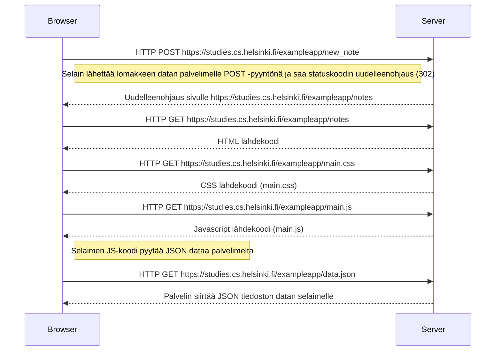

```mermaid

sequenceDiagram

  Browser ->> Server: HTTP POST https://studies.cs.helsinki.fi/exampleapp/new_note
  Note right of Browser: Selain lähettää lomakkeen datan palvelimelle POST -pyyntönä ja saa statuskoodin uudelleenohjaus (302)
  Server -->> Browser: Uudelleenohjaus sivulle https://studies.cs.helsinki.fi/exampleapp/notes
  Browser ->> Server: HTTP GET https://studies.cs.helsinki.fi/exampleapp/notes
  Server -->> Browser: HTML lähdekoodi
  Browser ->> Server: HTTP GET https://studies.cs.helsinki.fi/exampleapp/main.css
  Server -->> Browser: CSS lähdekoodi (main.css)
  Browser ->> Server: HTTP GET https://studies.cs.helsinki.fi/exampleapp/main.js
  Server -->> Browser: Javascript lähdekoodi (main.js)
  Note right of Browser: Selaimen JS-koodi pyytää JSON dataa palvelimelta
  Browser ->> Server: HTTP GET https://studies.cs.helsinki.fi/exampleapp/data.json
  Server -->> Browser: Palvelin siirtää JSON tiedoston datan selaimelle
  
```
