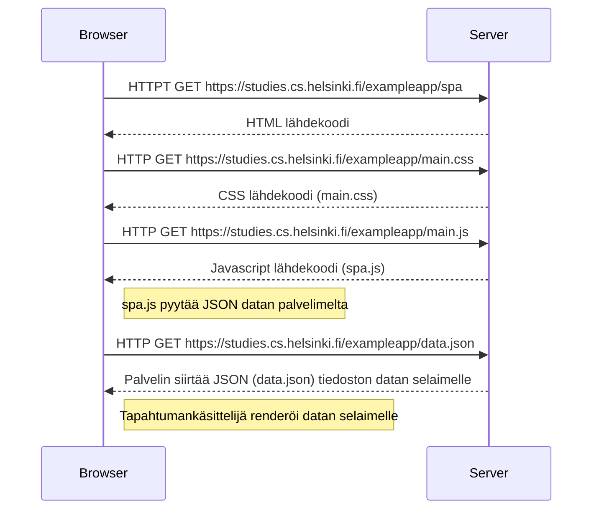

```mermaid

sequenceDiagram

  Browser ->> Server: HTTPT GET https://studies.cs.helsinki.fi/exampleapp/spa
  Server -->> Browser: HTML lähdekoodi 
  
  Browser ->> Server: HTTP GET https://studies.cs.helsinki.fi/exampleapp/main.css
  Server -->> Browser: CSS lähdekoodi (main.css)

  Browser ->> Server: HTTP GET https://studies.cs.helsinki.fi/exampleapp/main.js
  Server -->> Browser: Javascript lähdekoodi (spa.js)
  Note right of Browser: spa.js pyytää JSON datan palvelimelta
  
  Browser ->> Server: HTTP GET https://studies.cs.helsinki.fi/exampleapp/data.json
  Server -->> Browser: Palvelin siirtää JSON (data.json) tiedoston datan selaimelle
  Note right of Browser: Tapahtumankäsittelijä renderöi datan selaimelle
  
```